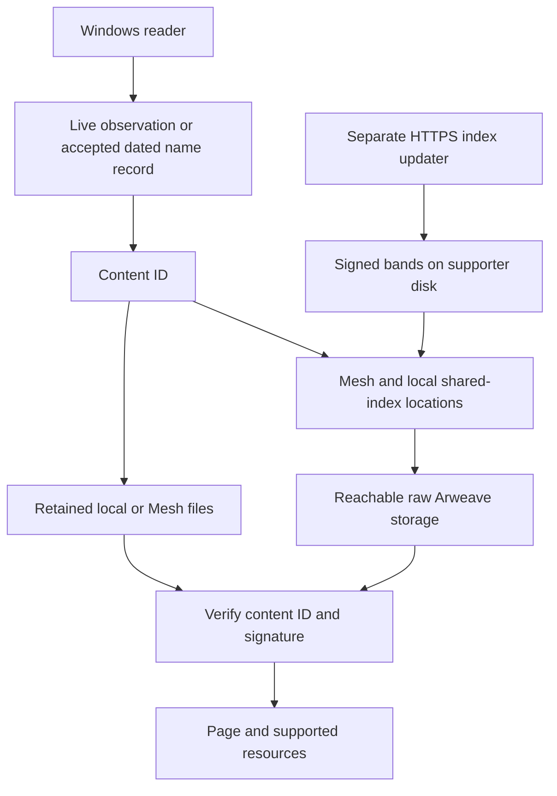

# Develop ArNS Mesh

[Türkçe](../tr/gelistirici.md) · [Home](../../README.md) · [Run a supporter without developing](supporter.md)

## Choose the right source

| Purpose | Revision |
|---|---|
| Published Windows preview.13 binary | `94ce5d293e3c97a78d1034b83ccbf1e21a2ee86b` |
| Supporter with R84 integration and documented preparation fixes | `37d51c79614c389b515b43d4a3bd92f9bd5083d2` on `feat/resilient-access` |
| Default branch | `main` still contains the preview.8 runtime; its documentation describes the published preview.13 path |

A server-side change does not replace the Windows ZIP. The guide's pinned supporter revision includes later documentation; it is not the source provenance of the already published desktop binary.

For runtime work, start from the relevant tested revision in a **separate checkout and data directory**. Check the current [development PR](https://github.com/Vevivo/arns-mesh/pull/9) before choosing a contribution base. Documentation-only updates can target `main` without merging runtime work.

## Reproduce the supporter source checks

```bash
git clone https://github.com/Vevivo/arns-mesh.git arns-mesh-development
cd arns-mesh-development
git checkout --detach 37d51c79614c389b515b43d4a3bd92f9bd5083d2
npm ci --omit=dev --ignore-scripts --no-audit --no-fund
npm run check:public
npm test
node scripts/doctor.mjs examples/network-profile.example.json
bash scripts/test-install.sh
```

Use Node.js 24 LTS; the CI baseline is 24.19.0. The last command is POSIX-only. Its installer test uses an npm test double; CI also installs real dependencies. The example profile contains nonworking documentation addresses. No production data is required.

## Architecture



Location hints do not establish name authority and are not content bytes. Content signature verification does not prove the latest name mapping. A new peer can supply independently verifiable bytes without being trusted to rename content.

## Source map

Paths below refer to the pinned supporter revision.

| Area | Entry points |
|---|---|
| Desktop UI and storage | `apps/browser` |
| Profile, invitation and runtime wiring | `apps/helper` |
| Headless service | `apps/peer/main.mjs`, `apps/peer/embedded-peer.mjs` |
| Public direct-IP protocol | `src/direct-peer.mjs` |
| Discovery and original-name relay | `src/peer-discovery.mjs`, `src/peer-directory.mjs`, `src/snapshot-relay.mjs` |
| Content identity and storage | `src/content-store.mjs`, `src/ans104.mjs` |
| Background preparation and budgets | `src/catalog-worker.mjs`, `src/site-pinner.mjs` |
| R84 publication and updater | `src/index-publication.mjs`, `scripts/configure-shared-index.mjs`, `scripts/sync-shared-index.mjs` |
| Local operator status | `src/operator-status.mjs`, `scripts/operator.mjs` |

The updater is an explicit online preparation boundary. Never import or spawn it inside the locked-down reader/peer process. Keep source/data separation and transport restrictions intact.

## Desktop and packaging

The lockfile excludes Electron itself. Use the project's pinned runtime; do not add a different Electron dependency just to launch it. For a development desktop, select an isolated directory with `ARNS_MESH_USER_DATA`.

The existing packaging scripts download the pinned official Electron runtime and build a new ZIP on an isolated build host:

```bash
python scripts/download-electron.py --out ../electron-runtime
python scripts/package-windows.py --runtime ../electron-runtime --out dist
```

Building the later supporter revision is not a reproduction of the published preview.13 ZIP. To reproduce that source baseline, use the desktop commit from the table and retain the package/UI evidence separately.

A Connected package can include a deliberately prepared network invitation; standard public packages do not. [Network and packaging operations](network-code.md).

## Preserve the evidence boundary

- Source tests, same-host process tests, real Windows UI checks, cached-object reads and independently isolated outage tests are different evidence.
- “Ready” site records are scoped; an HTML entry point is not a fully archived dynamic application.
- Ordinary browser use currently writes local data. There is no diskless mode.
- Independent replica placement/repair and real multi-provider/Pi acceptance remain open work. Do not mark them complete based on discovery tests.
- Use `npm run check:public` and inspect staged files before publishing. Do not commit runtime profiles, identities, invitations, logs or archives.

[Architecture detail](architecture.md) · [Peer protocol](shared-network.md) · [R84 operations](../shared-index.md) · [Current evidence](status.md) · [Contribution guidance](../../CONTRIBUTING.md).
